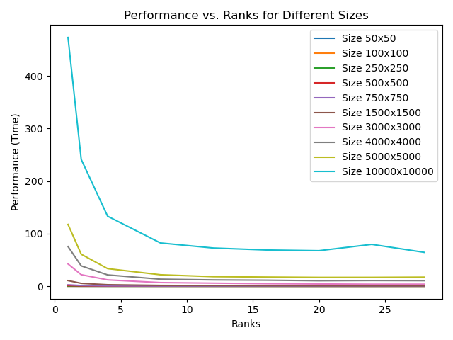
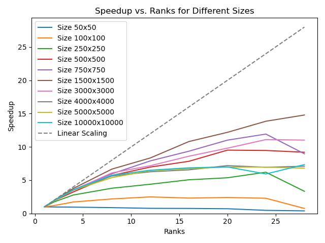
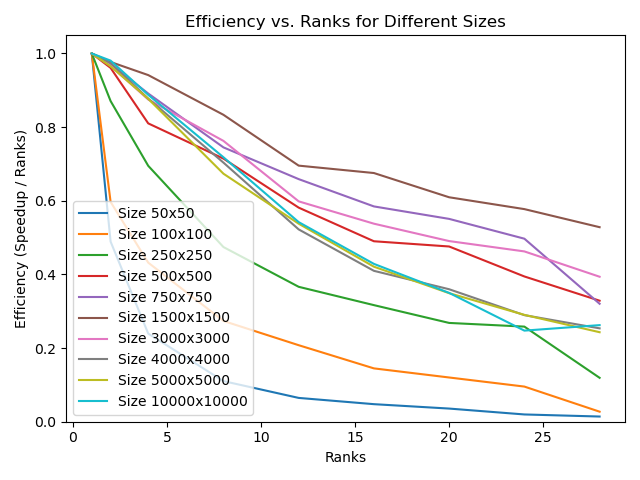

# Program Information

I have uploaded my C++ project to the GitHub for this class (https://github.com/tgmaxson/HPC_TGM) under folder “hw3”.  This is a modified form of HW1, which now supports OpenMP.

# Cluster Information

I am running on Ubuntu 22.04.2 LTS via a cluster known as “Clustie” to our research group, which I have full access to.  Tests are run on a test node which has nothing else running at the time of execution, except for SLURM and other background tasks which are default to Ubuntu Server installs.  GCC is version 11.4.0 and ICC is version 2021.10.0 via OneAPI released on 06/09/2023.  CUDA is provided via Nvidia HPC SDK version and nvcc is version cuda_12.0.r12.0/compiler.32267302_0 with CUDA version V12.0.140.

# System Hardware

Motherboard: H11SSL-i
CPU: Single Socket 32 Core AMD Epyc 7551P, 2.0 GHz, boost to 3.0 GHz.  SMT Disabled.
Memory: 256 GB of ECC DDR4-2400 via 8 x 32 GB sticks in 8 channel
GPU: 2 x MSI Suprim Liquid X24G RTX 4090 with 24GB of memory. 

# Original HW3 Submission

Problems Identified:
- Arrays are allocated on the stack not the heap, ulimit required to be set
- Parallel region set twice, resulting in nested threading incorrectly

The following test is particularly short, but this seems to work for a quick judgement if it is working since it should be linear in time even at fairly small sizes.  The goal here is just to identify when performance changes.  Tests are performed on 16 cores.

Performance test:
```bash
EXE: ./bin/hw3 SIZE: 1000 GENS: 100 SEC: 0.253979
EXE: ./bin/hw3 SIZE: 1000 GENS: 500 SEC: 0.240597
EXE: ./bin/hw3 SIZE: 5000 GENS: 100 SEC: 5.295664
EXE: ./bin/hw3 SIZE: 5000 GENS: 500 SEC: 5.209338
EXE: ./bin/hw3 SIZE: 10000 GENS: 100 SEC: 21.956519
EXE: ./bin/hw3 SIZE: 10000 GENS: 500 SEC: 21.180676

```

# Fixed array allocation

Arrays are now being allocated on the heap by allocating similar to sample.c provided as example.  Arrays are also properly freed at end of program.  In a fully proper program, we will also ensure that if the memory allocation fails, we do something special, but currently it is simply printed that it failed and the program will end up segfaulting.

Performance test:
```bash
EXE: ./bin/hw3 SIZE: 1000 GENS: 100 SEC: 0.257895
EXE: ./bin/hw3 SIZE: 1000 GENS: 500 SEC: 0.266482
EXE: ./bin/hw3 SIZE: 5000 GENS: 100 SEC: 5.226772
EXE: ./bin/hw3 SIZE: 5000 GENS: 500 SEC: 5.177519
EXE: ./bin/hw3 SIZE: 10000 GENS: 100 SEC: 22.201292
EXE: ./bin/hw3 SIZE: 10000 GENS: 500 SEC: 21.485131
```

# Fixed parallel region

Parallel region is now fixed by inlining the update function and only calling the parallel directive once.  The early break is eliminated from the code to avoid needing to update a flag in the parallel region, which was problematic.  Additionally, the performance tests are changing now since it turns out `const clock_t start_time = clock();` was providing a threaded CPU time rather than realtime.  

The main loop that has been fixed now looks like this.

```c
// Game loop
    #pragma omp parallel // Setup once
    for (int gen = 0; gen < MAX_GENERATIONS; ++gen) {
        #pragma omp for
        for (int i = 1; i <= N; i++) { // Bounds to only look at board without PBC to avoid issues
            for (int j = 1; j <= N; j++) {
                const int aliveNeighbors  = currentBoard[i - 1][j - 1] + currentBoard[i    ][j - 1] + currentBoard[i + 1][j - 1] +
                                            currentBoard[i - 1][j    ] +                            + currentBoard[i + 1][j    ] +
                                            currentBoard[i - 1][j + 1] + currentBoard[i    ][j + 1] + currentBoard[i + 1][j + 1];

                // Game of life
                if (currentBoard[i][j] == 1) { // Alive cell
                    if (aliveNeighbors < 2 || aliveNeighbors > 3) {
                        nextBoard[i][j] = 0; // Dies
                        //updated = 1;
                    } else {
                        nextBoard[i][j] = 1; // Lives
                    }
                } else { // Dead cell
                    if (aliveNeighbors == 3) {
                        nextBoard[i][j] = 1; // Becomes alive
                        //updated = 1;
                    } else {
                        nextBoard[i][j] = 0; // Stays dead
                    }
                }
            }
        }
        
        #pragma omp master // This part shouldn't be parallel
        {
            swapBoard(nextBoard, currentBoard); // Shuffle it in

            if (PRINT_ALL) { // Printing this run
                printBoard(currentBoard, N);
            }

            //if (updated) {
            //  breakLoop = 1;
            //}
        }
    }
```

Now the profiling is done via the following script.

Only evaluating 5000 generations to minimize time used but running 3 replicates to ensure timing is statistically correct.

```bash
#! /bin/bash
#SBATCH -J ProfileProgram
#SBATCH -N 1
#SBATCH -p main
#SBATCH --time=4:00:00
#SBATCH --ntasks-per-node=32

source ~/.bashrc
mamba activate work

gcc -o bin/hw3 hw3.c -lm -Wall -O3 -fopenmp

rm performance.txt

for size in 50 100 250 500 750 1500 3000 4000 5000 10000 20000
do 
  for threads in 1 2 4 8 12 16 20 24 28
  do
    for gens in 5000
    do 
      for replicates in {1..3}
      do
        ./bin/hw3 $size $gens output-$size-$gens.txt $threads 0 >> performance.txt
      done
    done
  done
done
```

The output is as follows.

```bash
EXE: ./bin/hw3, THREAD: 1, SIZE: 50, GENS: 5000, SEC: 0.015000 
EXE: ./bin/hw3, THREAD: 1, SIZE: 50, GENS: 5000, SEC: 0.015000 
EXE: ./bin/hw3, THREAD: 1, SIZE: 50, GENS: 5000, SEC: 0.015000 
EXE: ./bin/hw3, THREAD: 2, SIZE: 50, GENS: 5000, SEC: 0.012000 
EXE: ./bin/hw3, THREAD: 2, SIZE: 50, GENS: 5000, SEC: 0.013000 
EXE: ./bin/hw3, THREAD: 2, SIZE: 50, GENS: 5000, SEC: 0.021000 
EXE: ./bin/hw3, THREAD: 4, SIZE: 50, GENS: 5000, SEC: 0.016000 
EXE: ./bin/hw3, THREAD: 4, SIZE: 50, GENS: 5000, SEC: 0.015000 
EXE: ./bin/hw3, THREAD: 4, SIZE: 50, GENS: 5000, SEC: 0.016000 
EXE: ./bin/hw3, THREAD: 8, SIZE: 50, GENS: 5000, SEC: 0.017000 
EXE: ./bin/hw3, THREAD: 8, SIZE: 50, GENS: 5000, SEC: 0.017000 
EXE: ./bin/hw3, THREAD: 8, SIZE: 50, GENS: 5000, SEC: 0.017000 
EXE: ./bin/hw3, THREAD: 12, SIZE: 50, GENS: 5000, SEC: 0.019000 
EXE: ./bin/hw3, THREAD: 12, SIZE: 50, GENS: 5000, SEC: 0.021000 
EXE: ./bin/hw3, THREAD: 12, SIZE: 50, GENS: 5000, SEC: 0.018000 
...
```

Performance now appears to scale based on threads and problem size properly!  Plotted using plot.py in the current folder.





Interestingly, efficiency with number of cores improves up to a size of 1500x1500, then it starts to decrease.  This indicates that at smaller sizes, memory speed is likely a non-factor and the larger size means more cores spend less time in overhead.  At larger sizes, it likely becomes a memory bottleneck due to either the CPU cache or the memory access from RAM.  It is unclear however if utilizing even more cores would solve this issue as 28 cores is the largest job that can be run on our nodes without being impacted by GPU processes running in parallel.  

To optimize further, it is possible that changing the datatype used for the board from int to something else would allow for better data alignment in the cache and/or reduce memory bandwidth required.  I am not currently exploring this, but it seems like a rational approach to take to move from "int" to "char" for example.