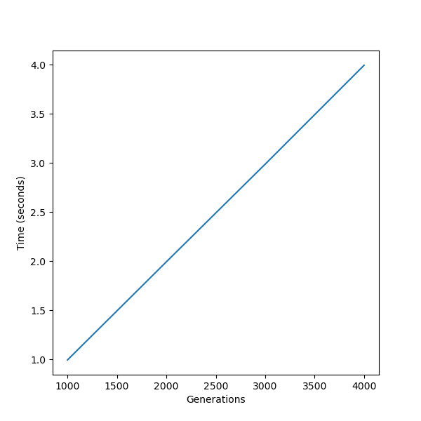
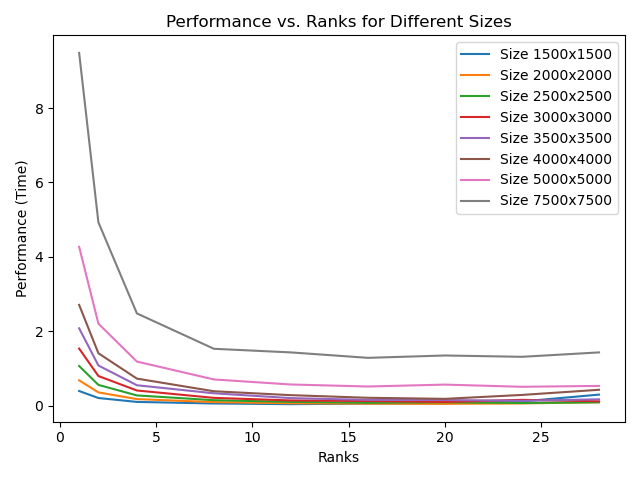
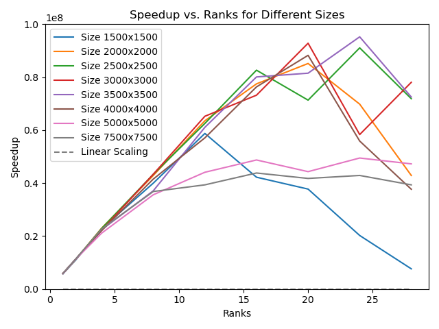

# Program Information

I have uploaded my C++ project to the GitHub for this class (https://github.com/tgmaxson/HPC_TGM) under folder “hw4”.  This is a modified form of HW3, which now supports MPI instead of OpenMP (not both).

# Cluster Information

I am running on Ubuntu 22.04.2 LTS via a cluster known as “Clustie” to our research group, which I have full access to.  Tests are run on a test node which has nothing else running at the time of execution, except for SLURM and other background tasks which are default to Ubuntu Server installs.  GCC is version 11.4.0 and ICC is version 2021.10.0 via OneAPI released on 06/09/2023.  CUDA is provided via Nvidia HPC SDK version and nvcc is version cuda_12.0.r12.0/compiler.32267302_0 with CUDA version V12.0.140.

# System Hardware

Motherboard: H11SSL-i
CPU: Single Socket 32 Core AMD Epyc 7551P, 2.0 GHz, boost to 3.0 GHz.  SMT Disabled.
Memory: 256 GB of ECC DDR4-2400 via 8 x 32 GB sticks in 8 channel
GPU: 2 x MSI Suprim Liquid X24G RTX 4090 with 24GB of memory. 

# Things to Address

As discussed previously, there appears to be a bug in the performance of the program and scatter / gather should really be used.  I have managed to set displacements and sizes correctly now using the following code.

```C
    // Calculate how many rows this process should handle
    const int rows_per_worker = N / WORLD_SIZE;
    const int remaining_rows = N % WORLD_SIZE;

    int *sizes = (int *)calloc(WORLD_SIZE, sizeof(int*));
    int *displacements = (int *)calloc(WORLD_SIZE, sizeof(int*));

    int *sizes_flat = (int *)calloc(WORLD_SIZE, sizeof(int*));
    int *displacements_flat = (int *)calloc(WORLD_SIZE, sizeof(int*));

    // Calculate displacements
    for (int i=0; i < WORLD_SIZE; i++) {
        sizes[i] = rows_per_worker + (i < remaining_rows);
        if (i != 0) { displacements[i] += displacements[i - 1] + sizes[i - 1]; }
    }

    // Calculate flat
    for (int i = 0; i < WORLD_SIZE; i++) {
        sizes_flat[i] = sizes[i] * (N + 2);
        displacements_flat[i] = (displacements[i] * (N + 2));
    }

    const int N_X = N;
    const int N_Y = sizes[WORLD_RANK];
```

To verify it works, I scatter the full board, clear the full board board, then regather to the full board.  The following output confirms this works.

```
-------------------------------------------
O O O O O O O O O O O O O O O O O O O O O O
O X O X X X X O O X X O X O X X O O O O O O
O X O X X O O O X X X X O O O X X X O X O O
O X X X X O X O O X O X O X O O X O O O X O
O X X O X O X O X X X O X O X O X O O X O O
O X O O O O O X X O X O O O O X O O O O X O
O X O O O X X X O X O O O X O O X X X O X O
O O X X X X X X X X X X O X X O X O X X O O
O O X O X X X O O O X O X O X O X O X X X O
O X O O O X O X O O O O O X O X X X X X O O
O O X X O X X O X O X X X X X O O X X O X O
O O O X X X O O O O O O O X X X O O X O X O
O O X O X O O X X O O X O O O X X X O O X O
O O O X X O O O O X O X X X O O X O O O O O
O O X O O O O O X O O O O O X X O O X X X O
O X O X O O X X X X O X X X O O X O O O O O
O O O O O O X X O X O X O O O X X O O O X O
O O X X O X X X X X O X X O X X O X O O O O
O O O O X O X O O O O O O X X O X O O O X O
O O O O O X X X O O X O O X X X O O X O O O
O X O X X X X O X X O O X O O O O O X O O O
O O O O O O O O O O O O O O O O O O O O O O
-------------------------------------------
-------------------------------------------
O O O O O O O O O O O O O O O O O O O O O O
O X O X X X X O O X X O X O X X O O O O O O
O X O X X O O O X X X X O O O X X X O X O O
O X X X X O X O O X O X O X O O X O O O X O
O X X O X O X O X X X O X O X O X O O X O O
O X O O O O O X X O X O O O O X O O O O X O
O X O O O X X X O X O O O X O O X X X O X O
O O X X X X X X X X X X O X X O X O X X O O
O O X O X X X O O O X O X O X O X O X X X O
O X O O O X O X O O O O O X O X X X X X O O
O O X X O X X O X O X X X X X O O X X O X O
O O O X X X O O O O O O O X X X O O X O X O
O O X O X O O X X O O X O O O X X X O O X O
O O O X X O O O O X O X X X O O X O O O O O
O O X O O O O O X O O O O O X X O O X X X O
O X O X O O X X X X O X X X O O X O O O O O
O O O O O O X X O X O X O O O X X O O O X O
O O X X O X X X X X O X X O X X O X O O O O
O O O O X O X O O O O O O X X O X O O O X O
O O O O O X X X O O X O O X X X O O X O O O
O X O X X X X O X X O O X O O O O O X O O O
O O O O O O O O O O O O O O O O O O O O O O
-------------------------------------------
``` 

I also found a bug related to swapping the boards with the pointers not being assigned in the same way as they were before.  The boards were not swapping leading to weird performance issues.  This has been addressed by changing 

```C
void swapBoard(int **board1, int **board2) {
    int *tempBoard = *board1;
    *board1 = *board2;
    *board2 = tempBoard;
}
```

to

```C
void swapBoard(int ***board1, int ***board2) {
    int **tempBoard = *board1;
    *board1 = *board2;
    *board2 = tempBoard;
}
```

and using `&board` not `board`.

# Re-analyze things

Lets confirm scaling by generations is linear for sanity's sake



This is true!  Good.

Now lets look at time execution of the program in general.



This indicates generally that time decreases as expected in a linear manner, but some weirdness is seen at small problem sizes.  Plotting as speedup shows more.


