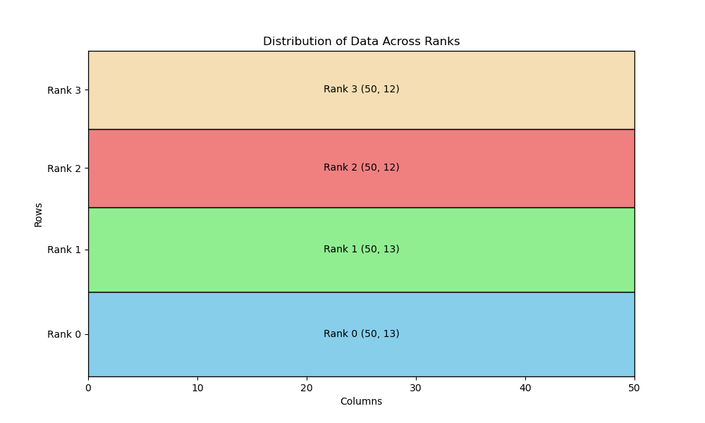

# Program Information

I have uploaded my C++ project to the GitHub for this class (https://github.com/tgmaxson/HPC_TGM) under folder “hw4”.  This is a modified form of HW3, which now supports MPI instead of OpenMP (not both).

# Cluster Information

I am running on Ubuntu 22.04.2 LTS via a cluster known as “Clustie” to our research group, which I have full access to.  Tests are run on a test node which has nothing else running at the time of execution, except for SLURM and other background tasks which are default to Ubuntu Server installs.  GCC is version 11.4.0 and ICC is version 2021.10.0 via OneAPI released on 06/09/2023.  CUDA is provided via Nvidia HPC SDK version and nvcc is version cuda_12.0.r12.0/compiler.32267302_0 with CUDA version V12.0.140.

# System Hardware

Motherboard: H11SSL-i
CPU: Single Socket 32 Core AMD Epyc 7551P, 2.0 GHz, boost to 3.0 GHz.  SMT Disabled.
Memory: 256 GB of ECC DDR4-2400 via 8 x 32 GB sticks in 8 channel
GPU: 2 x MSI Suprim Liquid X24G RTX 4090 with 24GB of memory. 

# Things to Address

Main issue with program is that it keeps the entire array on all ranks of the program.  This is non-ideal for memory / cache reasons and it would be better to only keep the memory required on each rank.  Solving this issue involves slightly more work to calculate what ranks have what data, but it is very solvable.

Additionally, we will try to implement OpenMP ontop of MPI here.  As of now this is not done though.

# Work distribution

To determine which ranks have what amount of work, we simply divide the grid size by the number of ranks.  The remainder represents how many rows need to still be assigned, so we assign those rows to the first X rows where X is the remainder.  This creates a slight load imbalance, but this is required if we do not want to restrict the grid size or parallelization options.  These extra rows simply make the blocks a rank works on a single row wider.

Here is an example of how things are done for 4 ranks in a 50x50 grid.

Most difficulty is coming from the need to now manage data as (N_X, N_Y) not (N, N).

# Gather/Scatter

No need to scatter since we can make all the arrays locally to each rank.  Gather also seems difficult to use for this purpose since the ghost cells make it difficult to gather the right data.  Since this is the non-performant part of the loop, I rebuild the full array on all ranks for now.

# Performance

