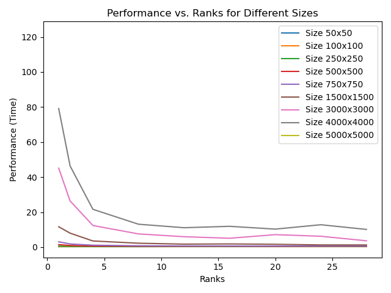
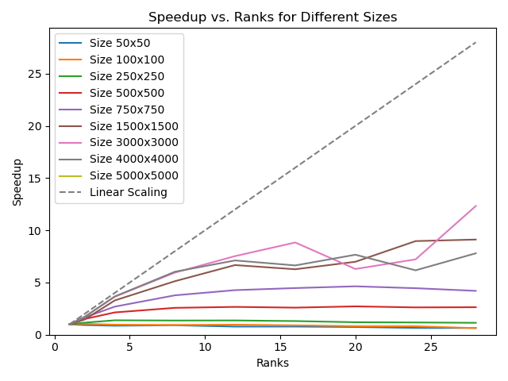
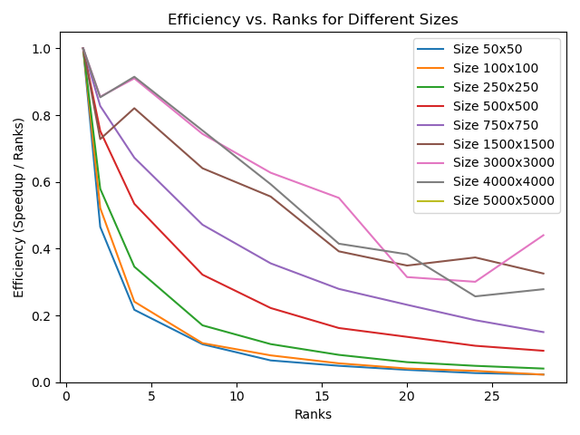
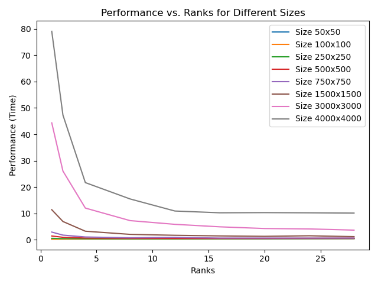
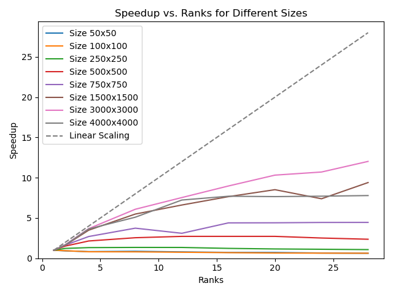
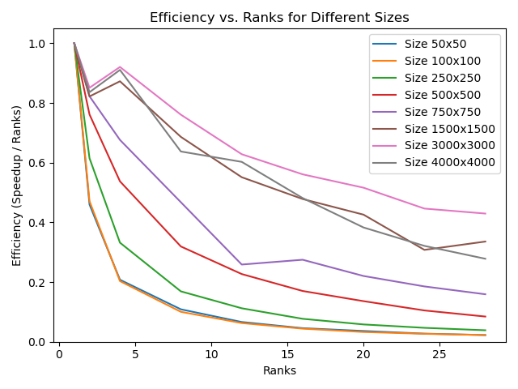
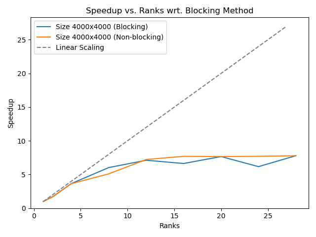
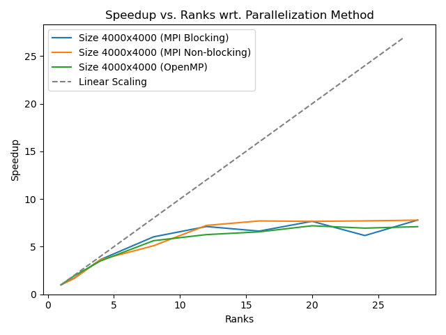

# Program Information

I have uploaded my C++ project to the GitHub for this class (https://github.com/tgmaxson/HPC_TGM) under folder “hw4”.  This is a modified form of HW3, which now supports MPI instead of OpenMP (not both).

# Cluster Information

I am running on Ubuntu 22.04.2 LTS via a cluster known as “Clustie” to our research group, which I have full access to.  Tests are run on a test node which has nothing else running at the time of execution, except for SLURM and other background tasks which are default to Ubuntu Server installs.  GCC is version 11.4.0 and ICC is version 2021.10.0 via OneAPI released on 06/09/2023.  CUDA is provided via Nvidia HPC SDK version and nvcc is version cuda_12.0.r12.0/compiler.32267302_0 with CUDA version V12.0.140.

# System Hardware

Motherboard: H11SSL-i
CPU: Single Socket 32 Core AMD Epyc 7551P, 2.0 GHz, boost to 3.0 GHz.  SMT Disabled.
Memory: 256 GB of ECC DDR4-2400 via 8 x 32 GB sticks in 8 channel
GPU: 2 x MSI Suprim Liquid X24G RTX 4090 with 24GB of memory. 

# How to Modify

To use MPI, the design of the program can remain essentially the same with the exception that we will only operate over some rows of the board on each rank.  This will result in the edge-cells of the region desyncronizing, so we will communicate in the loop to send the edges to each neighboring rank as a ghost cell.  These ghost cells act very similarly to the dead region around the original program, designed to simplify the game logic, but are now strictly required.

The initial array is broadcasted from master to each rank and the final array is collected from the relevant part of each rank via broadcast as well.  This means at the end, each rank will have the full final array, but only the master rank will use it.

# Profiling MPI version (blocking)

Now the profiling is done via the following script (similar to HW3).

Only evaluating 5000 generations to minimize time used but running 3 replicates to ensure timing is statistically correct.

```bash
#! /bin/bash
#SBATCH -J ProfileProgram
#SBATCH -N 1
#SBATCH -p main
#SBATCH --time=4:00:00
#SBATCH --ntasks-per-node=32

source ~/.bashrc
mamba activate work

rm bin/hw4
mpicc -o bin/hw4 hw4.c -lm -Wall -O3

rm performance.txt

for size in 50 100 250 500 750 1500 3000 4000 5000 10000 20000
do 
  for tasks in 1 2 4 8 12 16 20 24 28
  do
    for gens in 5000
    do 
      for replicates in {1..3}
      do
        mpirun -np $tasks ./bin/hw4 $size $gens output-$size-$gens.txt 0 >> performance.txt
      done
    done
  done
done

```

The output is as follows.

```bash
EXE: ./bin/hw4, RANKS: 1, SIZE: 50, GENS: 5000, SEC: 0.348000 
EXE: ./bin/hw4, RANKS: 1, SIZE: 50, GENS: 5000, SEC: 0.253000 
EXE: ./bin/hw4, RANKS: 1, SIZE: 50, GENS: 5000, SEC: 0.255000 
EXE: ./bin/hw4, RANKS: 2, SIZE: 50, GENS: 5000, SEC: 0.324000 
EXE: ./bin/hw4, RANKS: 2, SIZE: 50, GENS: 5000, SEC: 0.312000 
EXE: ./bin/hw4, RANKS: 2, SIZE: 50, GENS: 5000, SEC: 0.284000 
EXE: ./bin/hw4, RANKS: 4, SIZE: 50, GENS: 5000, SEC: 0.319000 
EXE: ./bin/hw4, RANKS: 4, SIZE: 50, GENS: 5000, SEC: 0.342000 
EXE: ./bin/hw4, RANKS: 4, SIZE: 50, GENS: 5000, SEC: 0.326000 
EXE: ./bin/hw4, RANKS: 8, SIZE: 50, GENS: 5000, SEC: 0.320000 
EXE: ./bin/hw4, RANKS: 8, SIZE: 50, GENS: 5000, SEC: 0.320000 
EXE: ./bin/hw4, RANKS: 8, SIZE: 50, GENS: 5000, SEC: 0.301000 
EXE: ./bin/hw4, RANKS: 12, SIZE: 50, GENS: 5000, SEC: 0.395000 
EXE: ./bin/hw4, RANKS: 12, SIZE: 50, GENS: 5000, SEC: 0.372000 
...
```

Performance appears to scale based on ranks and problem size properly!  Plotted using plot.py in the current folder.





In this test, we use MPI within a node, but I was able to confirm this still works if the ranks are split across two nodes.  

# Profiling MPI version (non-blocking)

Instead of using MPI_sendrecv as in the original version, we can do the communication in a non-blocking manner for the rows which do not use the ghost cells.  Then, while these rows are computing, the data will be transfered and we can finally do the last two rows (start_row and end_row).

The changes required look like the following

```c
    MPI_Request send_request_top, send_request_bottom, recv_request_top, recv_request_bottom;

    for(...) // Main row loop
        MPI_Irecv(currentBoard[start_row - 1], N, MPI_INT, prev_rank, 0, MPI_COMM_WORLD, &recv_request_top);
        MPI_Irecv(currentBoard[final_row], N, MPI_INT, next_rank, 0, MPI_COMM_WORLD, &recv_request_bottom);
        MPI_Isend(currentBoard[start_row], N, MPI_INT, prev_rank, 0, MPI_COMM_WORLD, &send_request_top);
        MPI_Isend(currentBoard[final_row - 1], N, MPI_INT, next_rank, 0, MPI_COMM_WORLD, &send_request_bottom);

        // Row logic

        // Now we must block to continue
        MPI_Wait(&recv_request_top, MPI_STATUS_IGNORE);
        MPI_Wait(&recv_request_bottom, MPI_STATUS_IGNORE);

        // Complete final two rows
```





We can see the program still performs similarly to the blocking version.  Lets try to plot speedups of both on the same plot for some size.



There is still no signifigant difference observed for these conditions, at most there is some improved consistency for the non-blocking version (but this may be variance within the 3 replicates, more would help).  If MPI communication was slower, the non-blocking would likely assist but on our cluster there is no signifigant difference within a node.  This could be extended for multi-node analysis.

# Final notes

This parallelization scheme sees designed to make it easy to program, but I would think that ideally this would not be done row-wise but by assigning rectangular sections of the array to each rank.  This would minimize the surface-area of the parallelized scheme and minimize communication.  This may not be important in this case, but it may be in other cases.

We can now also finally compare OpenMP and MPI.



It appears MPI is faster than OpenMP.  This is surprising to me but maybe there is a reason based on the cache or the blocking mechanisms.